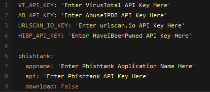

[](https://github.com/akshay-nehate/Socterminal)
[](https://github.com/akshay-nehate/Socterminal)

# Overview

SocTerminal is a tool developed with the task of aiding SOC analysts with automating part of their workflow. One of the goals of SocTerminal is to perform as many of the routine checks as possible, allowing the analyst more time to spend on deeper analysis within the same time-frame. Details for many of SocTerminal's features can be found below.

## Contents
 - [Current Features](#SocTerminal-can-currently)
 - [Requirements & Installation](#requirements-and-installation)
 - [Development](#development)
 - [Changelog](#changelog)
 - [Roadmap](#roadmap)
 - [Contributors](#contributors)

## SocTerminal can Currently:
  - Sanitise URL's to be safe to send in emails
  - Perform reverse DNS and DNS lookups
  - Perform reputation checks from:
    - [VirusTotal](https://www.virustotal.com)
    - [Abuse IPDB](https://www.abuseipdb.com/)
  - Identify if an address is potentially malicious, used for spam, web bots:
    - [Botvrij.eu](https://botvrij.eu)
    - [myip.ms](https://myip.ms)
    - [Firehol](https://raw.githubusercontent.com/firehol/blocklist-ipsets/master/nixspam.ipset)
  - Check if an IP address is a TOR exit node
  - Decode Proofpoint URL's, UTF-8 encoded URLS, Office SafeLink URL's, Base64 Strings and Cisco7 Passwords.
  - Get file hashes and compare them against [VirusTotal](https://www.virustotal.com) (see requirements)
  - Perform WhoIs Lookups
  - Check Usernames and Emails against [HaveIBeenPwned](https://haveibeenpwned.com) to see if a breach has occurred. (see requirements)
  - Simple analysis of emails to retrieve URL's, emails and header information.
  - Extract IP addresses from emails.
  - Unshorten URL's that have been shortened by external services. (Limited to 10 requests per hour)
  - Query [URLScan.io](https://urlscan.io) for reputation reports.
  - Analyze email addresses for known malicious activity and report on domain reputation utilising [EmailRep.io](https://emailrep.io)
  - Create dynamic email templates that can be used as a base for phishing triage response.(.msg only, .eml coming in future update)
  - Perform analysis enrichment on phishing mails using the HaveIBeenPwned database, and can identify if an email address has been compromised in the past, when it happened and where the breach occurred. (Requires API Key).
  - Submit URL's to [PhishTank](https://www.phishtank.com/). (see requirements)
  - [Unfurl](https://github.com/obsidianforensics/unfurl) URL's via the CLI version of Unfurl. 
  - See below for a full list and layout of currently available tools:
  
  
```
└── Main Menu
   ├── Sanitize URL's for use in emails
   |  └── URL Sanitizing Tool
   ├── Decoders
   |   ├── ProofPoint Decoder
   |   ├── URL Decoder
   |   ├── Office Safelinks Decoder
   |   ├── URL Unshortener
   |   ├── Base 64 Decoder
   |   ├── Cisco Password 7 Decoder
   |   └── Unfurl URL
   ├── Reputation Checker
   |   └── Reputation Checker for IP's, URL's or email addresses
   ├── DNS Tools
   |   ├── Reverse DNS Lookup
   |   ├── DNS Lookup
   |   └── WhoIs Lookup
   ├── Hashing Functions
   |   ├── Hash a File
   |   ├── Hash a Text Input
   |   ├── Check a hash for known malicious activity
   |   └── Hash a file and check for known malicious activity
   ├── Phishing Analysis
   |   ├── Analyze an Email
   |   ├── Analyze an email address for known malicious activity
   |   ├── Generate an email template based on analysis
   |   ├── Analyze a URL with Phishtank
   |   └── HaveIBeenPwned Lookup
   ├── URL Scan
   |   └── URLScan.io lookup
   ├── Extra's
   |   ├── About
   |   ├── Contributors
   |   ├── Version
   |   ├── Wiki
   |   └── Github Repo
   └── Exit
```


## Requirements and Installation
 - [Python 3.x](https://www.python.org/)
 - Install all dependencies from the requirements.txt file. `pip install -r requirements.txt`
 - Launch the tool by navigating to the main directory, and executing with `python Socterminal.py`, or simply `Socterminal.py` 
 - Several API Keys are required to have full functionality with Socterminal. However, it will still function without these keys, just without the added functionality they provide. Links are found below:
   - [VirusTotal API Key](https://developers.virustotal.com/reference)
   - [URLScan.io API Key](https://urlscan.io/about-api/)
   - [AbuseIPDB API Key](https://www.abuseipdb.com/api)
   - [HaveIBeenPwned API Key](https://haveibeenpwned.com/API/Key)
   - [PhishTank API Key](https://www.phishtank.com/api_info.php)
   - [EMAILREP API KEY](https://emailrep.io/key)
 - Replace the corresponding key in the `example_config.yaml` file, and rename the file to `config.yaml`, example layout below:
 - For PhishTank support, an unique app name is also required as an additional field. Simply update the `config.yaml` file with your unique name.
 


## Launch with Docker
- docker build -t Socterminal . && docker run --rm -it Socterminal 
 
 <!-- - To use the Hash comparison with VirusTotal requires an [API key](https://developers.virustotal.com/reference), replace the key `VT_API_KEY` in the code with your own key. The tool will still function without this key, however this feature will not work.
 - To use the Reputation Checker with AbuseIPDB requires an [API Key](https://www.abuseipdb.com/api), replace the key `AB_API_KEY` in the code with your own key. The tool will still function without this key, however this feature will not work.
 - To use the URLScan.io checker function with URLScan requires an [API Key](https://urlscan.io/about-api/), replace the key `URLSCAN_IO_KEY` in the code with your own key. The tool will still function without this key, however this feature will not work. 
 - Use of the HaveIBeenPwned functionality requires an [API Key](https://haveibeenpwned.com/API/Key), replace the key `HIBP_API_KEY` in the code with your own key. The tool will still function without this key, however this feature will not work. -->
 
## Development

### Want to contribute? Great!

  #### Code Contributions
  - If you wish to work on a feature, leave a comment on the issue page and I will assign you to it.
  - Under the projects tab is a list of features that are waiting to be started / completed. 
  - All code modifications, enhancements or additions must be done through a pull request. 
  - Once reviewed and merged, contributors will be added to the ReadMe.

### Found a Bug? Show Me!

 #### Bugs and Issues
 - If an issue / bug is found, please open a ticket in the issue tracker and use the bug report template. Fill in this template and include any additional relevant information.
 - If you wish to work on a known bug, leave a comment on the issue page and open a Pull Request to track progress. I will assign you to it.
 - If there is an issue with installation or usage, use the supplied template and I will respond ASAP.

 #### Requesting Features
 - New features / requests should start by opening an issue. Please use the accompanying template when creating a new issue. This helps track new features and prevent crossover. Attach any additional info that seems relevant if necessary. Before creating a new issue, please check the [Projects Tab](https://github.com/akshay-nehate/Socterminal/projects) to see if this issue has already been requested, or directly with the other open [issues.](https://github.com/akshay-nehate/Socterminal/issues)
 
## Changelog
TBD

## Roadmap
  This is an outline of what features *will* be coming in future versions.
